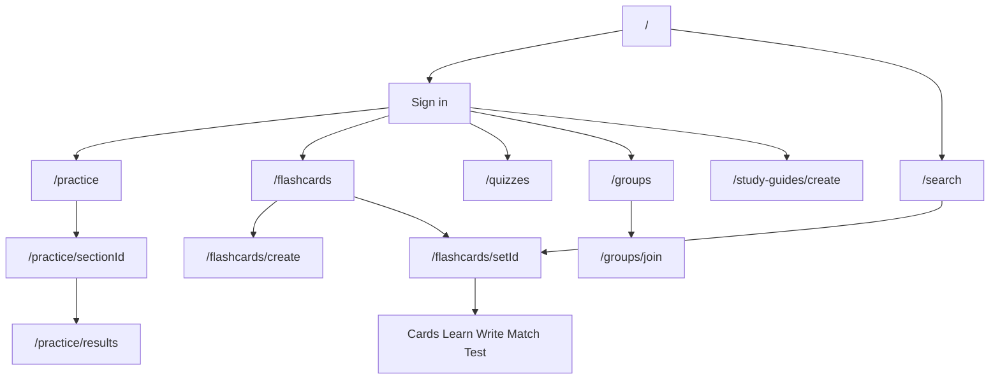

# AdvanceMe AI — Product specification

Authoritative product and roadmap document for **AdvanceMe AI** / **Advance.me**.  
Agent instructions live in **AGENTS.md**.

Historical planning artifacts (`PLAN.md`, former `SPEC.md`) are superseded by this file.

---

## 1. Product overview

### Product promise

AdvanceMe helps students **practice for the SAT** and **study any subject** with adaptive questions, rich flashcard workflows, and AI-assisted explanations—without requiring a separate app for drills vs. memorization.

### Target users

| Segment | Needs |
|---------|--------|
| **High-school students** | SAT section practice, full tests, mistake explanations, progress motivation |
| **Self-directed learners** | Create/import flashcard sets, multiple study modes, spaced repetition bookmarks |
| **Teachers / tutors** | Organize classes (study groups), share sets, invite students, track activity (partial today) |

### Core workflows

1. **Sign up / sign in** → Firebase Auth + HttpOnly session cookie for server APIs  
2. **SAT practice** → pick section → answer AI or bank questions → review results → optional “explain mistake”  
3. **Flashcards** → create or copy set → study (Cards / Learn / Write / Match / Test) → mastery persisted per user  
4. **Discover** → search public sets → open set → study or copy to library  
5. **Quizzes** → build or take short quizzes for quick checks  
6. **Classes** → teacher creates group → students join via code → shared sets (progress dashboard UI exists but is not fully wired)  
7. **AI study guide** → paste notes → generate outline + optional flashcards/questions → save set  

### Product goals

- Ship a credible **SAT practice** loop with measurable progress  
- Reach **parity with core Quizlet study loops** (create → study → share → discover) already started in code  
- Keep **one codebase** on Firebase + Vercel with clear service/repository layers  
- Improve **activation** (first set created, first practice completed) before adding premium monetization  

---

## 2. Current application state

*Sections below reflect codebase inspection on `dev` (May 2026). Items marked **(inferred)** are not backed by explicit docs in-repo.*

### What the app currently does

AdvanceMe is a **web app** (Next.js) that runs authenticated study sessions against **Firestore**, with **OpenAI** for generation and tutoring on select API routes. Anonymous users can browse marketing pages and search; most study actions require sign-in. **Test mode** (`NEXT_PUBLIC_ALLOW_TEST_MODE`) allows limited practice without auth when enabled.

### Current feature inventory

| Feature | Status | Primary surfaces |
|---------|--------|------------------|
| Email + Google auth | **Shipped** | `/auth/*`, `AuthProvider`, `/api/auth/session` |
| User profiles (username, role student/teacher) | **Shipped** | `/profile`, `/users/[username]`, `userProfiles` collection |
| SAT section practice | **Shipped** | `/practice/[sectionId]`, adaptive + AI questions |
| Full SAT practice test | **Shipped** | `/practice/full-test`, session APIs under `/api/practice-tests/sessions` |
| AI explain mistake | **Shipped** | Practice UI → `/api/ai/explain-mistake` |
| AI study plan | **Shipped** | `/api/ai/study-plan` |
| Flashcard sets CRUD | **Shipped** | `/flashcards/*`, `flashcardService` |
| Text import for cards | **Shipped** | `ImportModal`, `flashcardImport.ts` |
| Card images (Storage) | **Shipped** | `imageUploadService` |
| Five study modes | **Shipped** | `StudyFlashcardSetClient`, mode components |
| Folders | **Shipped** | Library UI + `flashcardFolderService` |
| Public / unlisted / private sets | **Shipped** | `visibility` + `isPublic` shim; search/rules enforce public-only discovery |
| Set copy | **Shipped** | `/api/flashcards/sets/[setId]/copy` |
| Share modal | **Shipped** | `ShareModal` on set page |
| Search public sets | **Shipped (basic)** | `/search`, `/api/search` — in-memory filter, not Algolia |
| Quizzes | **Shipped** | `/quizzes/*`, Firestore `quizzes` |
| Study groups (“Groups” in UI) | **Shipped** | `/groups/*`, `studyGroupService` |
| Teacher-only classes API | **Shipped** | `classService` wraps groups with `isTeacher` gate |
| Class progress dashboard | **Shipped** | `/groups/[groupId]` for owners/admins via `/api/groups/[id]/progress` |
| Gamification (XP, levels, achievements, streaks) | **Shipped (client-heavy)** | Zustand + `gamificationService` / Firestore |
| Progress analytics page | **Shipped** | `/progress` — Firestore-backed calendar, weekly minutes, mastery, topics |
| AI study guide from text | **Shipped** | `/study-guides/create`, `/api/ai/study-guide` |
| AI tutor chat | **Shipped** | `/api/ai/chat` |
| Live multiplayer games | **Prototype UI only** | `/live/*` — local state; comment notes missing Realtime DB **(inferred: not production-ready)** |
| Dark / system theme | **Shipped** | `ThemeProvider`, `data-theme` on `<html>` |
| PWA / offline | **Not present** | — |
| Subscriptions / billing | **Not present** | — |

### Current user flows

### Existing integrations

| Integration | Usage |
|-------------|--------|
| **Firebase Auth** | Client sign-in; ID token exchanged for session cookie |
| **Firestore** | Sets, quizzes, groups, profiles, practice attempts, gamification |
| **Firebase Storage** | Flashcard images (`firebasestorage.googleapis.com` in `next.config.ts`) |
| **OpenAI** | Questions, study guide, chat, explain mistake, study plan |
| **Vercel** | Hosting; 300s function timeout |
| **Google OAuth** | Sign-in provider |

No Stripe, email provider, search SaaS, or Firebase Realtime Database in production paths today.

### Current architecture summary

- **Next.js 16** App Router: RSC pages with client islands  
- **Route Handlers** for AI, auth session, practice test sessions, search, copy set  
- **Service layer** with LRU-style cache (`createCachedService`)  
- **Repository layer** under `src/api/firebase/`  
- **Auth**: dual client (`useAuth`) + server session cookie; **no middleware auth**  
- **No Server Actions, no job queue**  

### Existing technical constraints

- Firestore has **no native full-text search**; `/api/search` loads up to 200 public sets and filters in memory  
- AI routes require **`OPENAI_API_KEY`**; question model defaults to **`gpt-4.1`** in code (README still mentions gpt-4.1-mini in places — treat code as truth)  
- Server features need **Firebase Admin** env vars; without them, session verification and admin APIs return degraded responses  
- **Strict TypeScript** and unused-symbol rules increase friction on large refactors  
- **Jest** passes with no tests — regressions rely on manual QA and `next build`  

### Known limitations

1. **Live games** do not sync between clients (UI demonstration only).  
2. **Progress page** uses simulated weekly/mastery data, not full Firestore aggregation.  
3. **Class progress** reads live flashcard study data; time-spent metrics are not yet persisted (shown as 0).  
4. **Product positioning** is split: marketing and `/practice` emphasize SAT; `PLAN.md` era work targeted Quizlet parity—roadmap below unifies without new product lines.  
5. **Groups vs. classes**: routes and copy say “Groups”; teacher flows use `classService`.  
6. **`visibility` vs. `isPublic`**: dual model; search and rules still lean on `isPublic`.  
7. **Security rules** deny catch-all; any new collection needs explicit rules.  
8. **README** still suggests feature-branch workflow; git policy is **main + dev** (see AGENTS.md).  

---

## 3. Product roadmap

Ordered **PR-sized milestones** for `dev`. Each should be one focused commit sequence with acceptance criteria and user value.

### Milestone 1 — Authenticated home dashboard ✅

**Status:** Completed (2026-05-27)

**User value:** Signed-in users land on a useful hub instead of the marketing page.

**Intent:** Extend `/` or add `/dashboard` (logged-in only) with recent sets, continue-studying links, streak/XP snippet, and quick actions (create set, start practice).

**Acceptance criteria:**
- Signed-in user sees recent flashcard sets and last practice section within 2s on warm load  
- Signed-out user still sees current marketing home  
- Data comes from existing services (no mock placeholders)  

**Implementation note:** `/` renders `HomeDashboard` (server-loaded via Firebase Admin) when a session exists; falls back to `HomeDashboardClient` (flashcard + gamification services) if Admin is unavailable. Continue-studying uses latest `practiceAttempts` or `flashcardStudyProgress` activity via `pickContinueStudying`.

**Depends on:** None  

---

### Milestone 1b — Firestore index for dashboard practice query ✅

**Status:** Completed (2026-05-27)

**User value:** Continue-studying on the home dashboard reliably surfaces the last SAT section practiced.

**Intent:** Add and deploy a composite Firestore index on `practiceAttempts` (`userId` ASC, `createdAt` DESC) so `loadDashboardData` can query last attempt without falling back to flashcards-only.

**Acceptance criteria:**
- Index defined in repo (`firestore.indexes.json` or documented deploy step)  
- Dashboard shows practice continue card when user has practice attempts  

**Implementation note:** Added `firestore.indexes.json` and `firebase.json` with composite indexes for `practiceAttempts` (dashboard continue), `flashcardSets` by `userId` (recent sets), and `flashcardSets` by `isPublic` (search API). Deploy indexes to your Firebase project with `firebase deploy --only firestore:indexes` (requires Firebase CLI and project config). Regression tests in `src/lib/firestore-indexes.test.ts` assert required index definitions.

**Depends on:** Milestone 1  

---

### Milestone 2 — Wire class progress for teachers ✅

**Status:** Completed (2026-05-27)

**User value:** Teachers see which students engaged with shared sets.

**Intent:** Mount `ClassProgressDashboard` on `/groups/[groupId]` for owners/admins; persist/read progress via `class-progress` types and existing group/shared-set linkage.

**Acceptance criteria:**
- Teacher on a group they own sees per-member activity for shared sets  
- Students do not see other students’ private stats  
- Empty state when no shared sets or no activity  

**Implementation note:** Managers see `ClassProgressDashboard` on the group detail page. Progress is aggregated from `users/{studentId}/flashcardStudyProgress` for shared set IDs via `GET /api/groups/[groupId]/progress` (Firebase Admin, session + `canManageGroup` gate). Pure aggregation in `class-progress-aggregate.ts`; students never receive the API payload (403).

**Depends on:** Milestone 1 (optional but helps navigation)  

---

### Milestone 3 — Real progress analytics ✅

**Status:** Completed (2026-05-27)

**User value:** Students trust the Progress page for streaks, mastery, and time spent.

**Intent:** Replace mock data on `/progress` with aggregates from `flashcardStudyService`, practice attempts, and `gamificationService`.

**Acceptance criteria:**
- Weekly minutes and mastery breakdown match Firestore study records  
- Loading and empty states for new users  
- No regression to gamification XP display on `/profile`  

**Implementation note:** `/progress` loads `loadUserProgressAnalytics` (practice attempts via `listUserPracticeAttempts`, flashcard progress + sets). Pure aggregation in `progress-analytics.ts`; streak card uses `lastStudyDate` from `useGamification`. Header stats remain gamification-backed.

**Depends on:** None (can parallel with Milestone 2)  

### Milestone 3b — Historical flashcard study minutes ✅

**Status:** Completed (2026-05-27)

**User value:** Weekly minutes reflect actual flashcard session duration, not a fixed estimate per set update.

**Intent:** Persist per-session duration on flashcard study completion and include it in progress analytics.

**Acceptance criteria:**
- Weekly chart uses stored session minutes when available  
- Falls back to estimate only for legacy rows without duration  

**Implementation note:** Learn/Write/Match/Test modes pass `flashcardSetId` into `recordSessionComplete`; durations append to `recentSessions` on `users/{uid}/flashcardStudyProgress/{setId}` (max 60). `progress-analytics` sums recorded minutes per day; legacy rows without `recentSessions` still use the 5-minute estimate.

**Depends on:** Milestone 3  

---

### Milestone 4 — Visibility model completion ✅

**Status:** Completed (2026-05-27)

**User value:** Creators control who can find and study their sets (public / unlisted / private).

**Intent:** Migrate reads/writes/search to `visibility`; keep `isPublic` compatibility shim during transition; update `firestore.rules` and search API.

**Acceptance criteria:**
- Creating/editing set exposes three visibility options  
- Search returns only `public` sets; unlisted accessible via direct link  
- Private sets unreadable by non-owners in client and rules  

**Implementation note:** Centralized helpers in `flashcard-visibility.ts`; shared `VisibilityField` on create/edit; Firestore rules use `canReadFlashcardSet`; search API filters `isSearchableVisibility`; server set page gates private sets; copy allows public/unlisted.

**Depends on:** None  

---

### Milestone 5 — Set landing page UX ✅

**Status:** Completed (2026-05-27)

**User value:** Studying a set feels intentional (mode picker, stats, share/copy) like mainstream flashcard apps.

**Intent:** Consolidate set detail UX on `/flashcards/[setId]`—header stats (`timesStudied`), prominent mode grid, owner edit/copy/share, optional “Add to folder/class”.

**Acceptance criteria:**
- User can start any study mode in one click from set landing  
- Owner sees edit + visibility + share; non-owner sees copy (if allowed)  
- Mobile layout usable at 375px width  

**Implementation note:** `SetLandingOverview` on `/flashcards/[setId]` with stats grid (terms, times studied, mastery, visibility), progress bar, `StudyModeGrid`, owner share/edit/visibility/folder controls (`AddSetToFolderControl`), and copy for allowed non-owners. `timesStudied` increments on completed study sessions; landing refetches set when returning to overview.

**Depends on:** Milestone 4 (visibility on share links)  

### Milestone 5b — Add set to class from landing (follow-up)

**User value:** Teachers add a set to a class without leaving the set page.

**Intent:** Share set to an owned study group from set landing (owner-only).

**Acceptance criteria:**
- Owner can pick a class/group and attach the set  
- Non-owners do not see class controls  

**Depends on:** Milestone 5  

---

### Milestone 6 — Live game minimum viable sync

**User value:** Classes can run a short live review game in real time.

**Intent:** Add Firebase Realtime Database (or Firestore listeners) + `liveGameService`; host creates game from `/live/host`; players join via code; scores update for all clients.

**Acceptance criteria:**
- Two browsers with same join code see the same player list and question index  
- Host can start/end game; players see results  
- Game cannot start without at least one joined player  

**Depends on:** Milestone 5 (set selection for host)  

---

### Milestone 7 — SAT practice onboarding

**User value:** New users complete first practice quickly and understand section map.

**Intent:** First-run checklist on `/practice` (pick goal section, complete 5 questions, view explanation); tie into gamification achievements (`first-steps`, `sat-ready`).

**Acceptance criteria:**
- New account sees guided empty state on `/practice`  
- Completing first section attempt marks checklist done and awards XP  
- Test mode still works when `NEXT_PUBLIC_ALLOW_TEST_MODE` is true  

**Depends on:** Milestone 1  

---

### Milestone 8 — Search relevance and scale

**User value:** Learners find useful public sets as library grows.

**Intent:** Add subject filters and popularity sort using existing `subjects` / `timesStudied`; document Algolia/Typesense path if Firestore scan exceeds budget.

**Acceptance criteria:**
- Search supports sort: recent vs. popular  
- Subject filter narrows results  
- p95 search response &lt; 1s for 1k public sets **(inferred target)**  

**Depends on:** Milestone 4  

---

### Milestone 9 — Study guide retention loop

**User value:** AI-generated guides become durable study artifacts, not one-off screens.

**Intent:** Persist `StudyGuide` documents in Firestore; list/reopen from dashboard; “Save as set” idempotent.

**Acceptance criteria:**
- User sees list of past study guides  
- Re-open guide restores outline and linked set id  
- Rate limit or error message when OpenAI unavailable  

**Depends on:** Milestone 1  

---

### Milestone 10 — Groups renamed to Classes (UX only)

**User value:** Teachers recognize classroom semantics without learning new jargon.

**Intent:** UI copy and routes alias (`/classes` redirect to `/groups` or rename with redirects); navbar entry for teachers; no breaking change to `studyGroups` collection name until a dedicated migration milestone.

**Acceptance criteria:**
- Teacher role sees “Classes” in nav; student sees “My classes” or “Joined classes”  
- Invite flow unchanged functionally  
- Bookmarks to `/groups/*` redirect  

**Depends on:** Milestone 2  

---

## Out of scope (until product decides otherwise)

- Native mobile apps, PWA offline mode  
- Paid subscriptions (Quizlet Plus parity)  
- Diagram sets, OCR scan-to-set, Expert Solutions  
- SSO with Google Classroom  
- Admin moderation console  

---

## Document map

| File | Role |
|------|------|
| **spec.md** (this file) | Product truth + roadmap |
| **AGENTS.md** | How agents build and validate |
| **README.md** | Install, env, human quick start |
| **docs/ENV_EXAMPLE.md** | Environment variables |
| **PLAN.md** | Pointer only — see spec.md §3 |
| **CLAUDE.md** | Pointer only — see AGENTS.md |

---

*Last updated: 2026-05-26*
